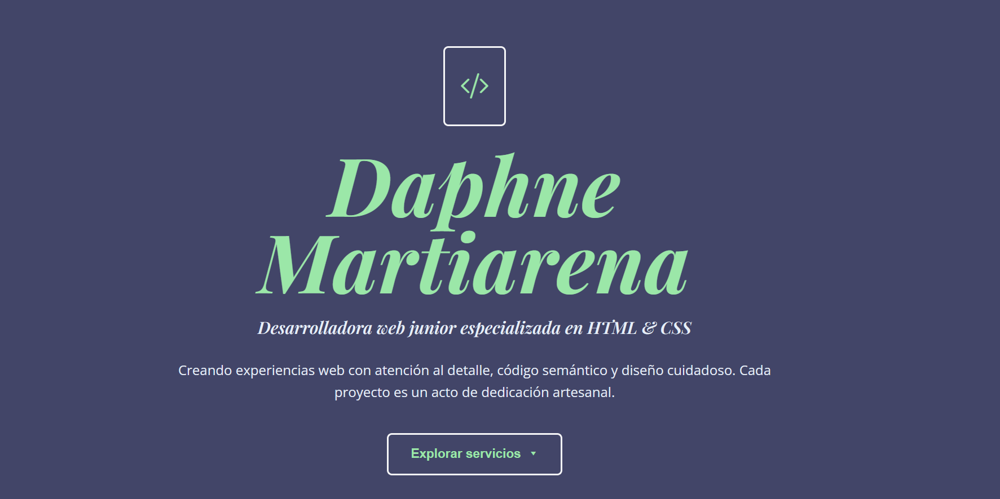

# Guía de Optimizaciones PageSpeed

## ✅ Optimizaciones Implementadas

### 1. Recursos que bloquean el renderizado (-600ms)
- ✅ Agregado `defer` al script main.js
- ✅ Agregado `preconnect` para Google Fonts y CDNs
- ✅ Carga diferida de Google Fonts con `media="print" onload="this.media='all'"`
- ✅ Carga diferida de Bootstrap Icons
- ✅ Fuentes con fallback a fuentes del sistema

### 2. Optimización de imágenes (-1961 KB)
- ✅ Agregado `loading="lazy"` a todas las imágenes
- ✅ Agregado dimensiones width/height para evitar layout shifts
- ✅ CSS para imágenes responsivas

### 3. Visualización de fuentes (-30ms)
- ✅ Display=swap en Google Fonts URL
- ✅ Preconnect a fonts.googleapis.com y fonts.gstatic.com

## 📋 Pasos Adicionales Recomendados

### A. Convertir imágenes a WebP (IMPORTANTE)

1. Instala la librería de optimización:
\`\`\`bash
npm install sharp
\`\`\`

2. Ejecuta el script de optimización:
\`\`\`bash
node optimize-images.js
\`\`\`

3. Actualiza las referencias en index.html:
- `Portafolio.png` → `Portafolio.webp`
- `veterinaria.png` → `veterinaria.webp`
- `tienda virtual.png` → `tienda virtual.webp`

4. Usa el formato `<picture>` para mejor compatibilidad:
\`\`\`html
<picture>
  <source srcset="Portafolio.webp" type="image/webp">
  
</picture>
\`\`\`

### B. Minificar CSS y JavaScript

Opción 1 - Manual online:
- CSS: https://cssminifier.com/
- JS: https://javascript-minifier.com/

Opción 2 - Build tools:
\`\`\`bash
npm install --save-dev cssnano postcss-cli terser
\`\`\`

Agrega a package.json:
\`\`\`json
"scripts": {
  "build:css": "postcss style.css -o style.min.css",
  "build:js": "terser main.js -o main.min.js",
  "build": "npm run build:css && npm run build:js"
}
\`\`\`

### C. Habilitar compresión en servidor

Si usas Apache, el archivo `.htaccess` ya está creado con:
- Compresión GZIP
- Cache de navegador

Si usas Vercel, agrega a `vercel.json`:
\`\`\`json
{
  "headers": [
    {
      "source": "/(.*)",
      "headers": [
        {
          "key": "Cache-Control",
          "value": "public, max-age=31536000, immutable"
        }
      ]
    }
  ]
}
\`\`\`

### D. Cargar iconos críticos inline

En lugar de cargar todo Bootstrap Icons, considera:
1. Usar solo los SVG que necesitas
2. Incluirlos inline en el HTML
3. O usar un sprite sheet SVG

### E. Agregar Service Worker para cache

Crea `sw.js`:
\`\`\`javascript
const CACHE_NAME = 'portfolio-v1';
const urlsToCache = [
  '/',
  '/style.css',
  '/main.js',
  '/Portafolio.webp',
  '/veterinaria.webp',
  '/tienda virtual.webp'
];

self.addEventListener('install', event => {
  event.waitUntil(
    caches.open(CACHE_NAME)
      .then(cache => cache.addAll(urlsToCache))
  );
});
\`\`\`

## 🎯 Resultados Esperados

Después de implementar todo:
- **Rendimiento**: 66 → 90+
- **Tiempo de carga**: Reducción de ~2.5 segundos
- **Tamaño total**: Reducción de ~2MB

## 🔍 Verificación

1. Ejecuta PageSpeed Insights nuevamente
2. Verifica en DevTools > Network que:
   - Las fuentes cargan con `font-display: swap`
   - Las imágenes cargan con lazy loading
   - Los recursos externos tienen preconnect
3. Usa Lighthouse en Chrome DevTools

## 📊 Prioridades

Alta prioridad (hacer ahora):
1. ✅ Recursos que bloquean renderizado
2. 🔲 Convertir imágenes a WebP
3. 🔲 Minificar CSS/JS

Media prioridad:
4. 🔲 Habilitar compresión servidor
5. 🔲 Optimizar iconos

Baja prioridad:
6. 🔲 Service Worker
7. 🔲 Lazy loading avanzado
